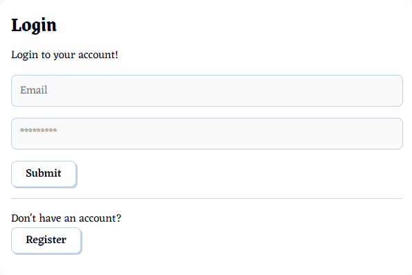
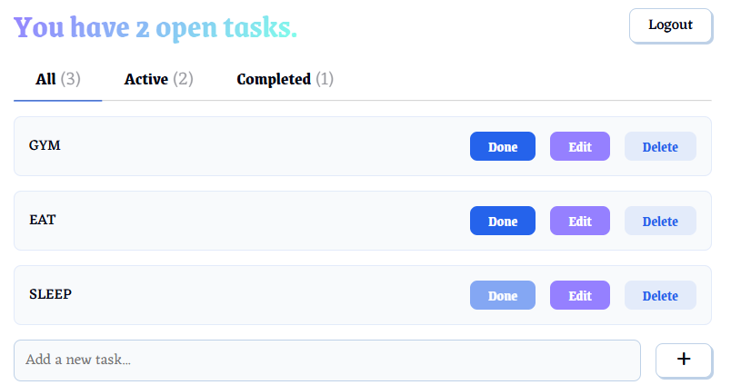

# React To-Do App

A simple and intuitive **To-Do List** application built with **React**, **Node.js**, **Express.js**, **Prisma**, **PostgreSQL**, & **Docker**.  

🔗 **Live Demo:** [React To-Do App on Netlify](https://rakeeb-todo-app.netlify.app/)

---

## Table of Contents
- [Features](#features)
- [Demo](#demo)
- [Getting Started](#getting-started)
  - [Prerequisites](#prerequisites)
  - [Setup & Run](#setup--run)
- [Usage](#usage)
- [Project Structure](#project-structure)
- [Credits](#credits)

---

## Features
- **Add**, **Edit**, and **Delete** tasks
- Mark tasks as **completed / uncompleted**
- **Filter tasks** by status: All, Active, Completed
- **Persistent storage** — tasks are saved in **PostgreSQL**
- **Authentication/Authorization** - Secured with **bcrypt** and **JWT** 

## Demo
🔗 [Click here to try the app](https://rakeeb-todo-app.netlify.app/)





Note: This demo has limited features and doesn't use any backend (due to limitations with netlify). It is only for frontend demonstration purposes.

## Getting Started

### Prerequisites
Make sure you have  **Docker Desktop** installed.

### Setup & Run
```bash
# Clone the repo
git clone https://github.com/rakeebh7233/react-todo-app.git

# Navigate into the project
cd react-todo-app

# Generate Prisma Client
npx prisma generate

# Build docker images
docker compose build

# Create PostgreSQP migrations and apply them
docker compose run app npx prisma migrate deploy

# Boot up docker containers
docker compose up
```
Then, open your browser and go to http://localhost:5000.

### Usage
* Add a task: Enter text in the input field and hit Enter or click "Add".
* Mark Complete/incomplete: Use the button next to each task.
* Filter tasks: Switch between All, Active, or Completed views.
* Delete a task: Click the delete button next to a task.
* Edit a task: Click the edit button next to a task.
* Persistence: Tasks remain saved in your browser even after refresh.

## Project Structure
```
fullstack-todo-app/
├── prisma/                           # Prisma ORM setup: schema, migrations, and database configuration
├── public/
├── src/
│   ├── components/                   # React components (e.g., TodoCard, TodoList, Input)
│   ├── context/AuthContext.jsx       # Global Authentication Context
│   ├── middleware/authMiddleware.js  # Middleware for veryifying JWT and protecting routes
│   ├── routes/
│   │   ├── authRoutes.js             # Authentication Endpoints
│   │   └── todoRoutes.js             # TodoList Endpoints
│   ├── styles/                       # CSS files
│   ├── App.jsx                       # Main app logic
│   ├── db.js                         # [Unused] DB for development purposes
│   ├── main.jsx                      # React entry point
│   ├── prismaClient.js               # Prisma client database setup and table creation
│   └── server.js                     # Main server entry point that sets up routing and middleware
│
├── docker-compose.yaml
├── Dockerfile
├── index.html
├── package.json
├── vite.config.js
├── eslint.config.js
└── README.md
```
--- 
## Credits
- CSS styling adapted from **Fantacss** by [jamezmca](https://github.com/jamezmca/fantacss) — licensed under the **MIT License**.

